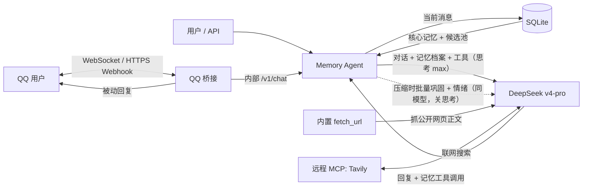

# DeepSeek + SQLite 长期记忆助手

[](https://github.com/VesperGlow/mneme/actions/workflows/build.yml)

一个可直接容器化部署的个人情感陪伴助手，**一个 Rust 单二进制**（axum + rusqlite）内完成一切：SQLite 单文件保存对话、长期记忆与情绪时间线；记忆永久留存；QQ 桥接按官方开放平台协议与私聊（C2C）通信。填好 `.env` 一条命令即可启动。

两个设计取向贯穿全局：

- **一个模型做所有事**。`deepseek-v4-pro` 既负责对话（思考等级 `max`），也负责记忆的结构化抽取（关思考）。整个进程只有 axum 与 SQLite，稳态内存二三十兆。
- **记忆尽量不经过筛选**。活跃记忆装得下时，整份记忆档案直接挂进主模型的 system 段，让它一边看着全部记忆一边回话——检索这一步根本不存在。只有记忆多到装不下，才退回「让模型先挑几条」。



## 功能总览

- **整池直供的记忆上下文**：活跃记忆不超过 `MEMORY_INLINE_MAX`（默认 300）时，整份档案挂进 system 段，零额外往返、零额外延迟，也不存在「挑漏了的记忆主模型再也看不到」这种查不出来的失败。超过上限才降级成精选（见[检索](#检索整池直供精选是降级路径)）。
- **核心记忆永远在场**：硬约束（过敏、忌口、健康与安全禁忌）与助手自己许下的承诺单独成段，**每轮无条件注入、不参与精选**。措辞上也与普通记忆区分：普通记忆是「背景印象、别主动提」，核心记忆是「可以不提，但绝不能违反」。
- **压缩时批量巩固**：对话被压缩（旧消息滑出短期窗口）时，对整批已结束的对话做一次巩固——挑出值得长期记住的信息、对照已有记忆决定新增还是取代，顺带抽取情绪。热路径每轮不做自动记忆。另有**尾巴 flush**（`MEMORY_FLUSH_*`）定时扫描空闲够久的会话，把仍在窗口内的最后一段也巩固掉，避免用户长期沉默时最后说的话丢失。
- **短期上下文 + 滚动摘要**：每会话最近 N 条原文滑动窗口，确定顺序不丢；更早的消息后台压缩进会话摘要，超长对话也保留连续性。
- **记忆演变（SUPERSEDES）**：用户情况变化时新记忆取代旧记忆，旧的软停用但保留，可回溯完整时间线。
- **记忆主体（subject）**：`user` 是关于用户的事实与偏好，`assistant` 是助手自己对用户的承诺、约定或人设设定。后者随硬约束一起进核心段，写入时按主体隔离去重。
- **单文件存储**：SQLite 一个文件装下对话、记忆、实体关联与情绪时间线，全是普通关系表，备份即拷文件，所有记忆按 `user_id` 隔离。
- **情绪时间线**：从对话抽取情绪按时间成链，让助手感知跨会话情绪趋势。
- **分层提示词**：人设层（`PERSONA_PROMPT` 可整体替换口吻，对所有入口生效）与系统指令层（输出格式、记忆工具、安全）分离，系统指令始终生效、优先于人设。
- **网页抓取（内置）**：`fetch_url` 工具直接拉取公开链接、抽正文转 Markdown 回传给模型，纯 Rust、无外部服务；只处理静态/SSR 页面，不渲染 JS。
- **MCP 工具**：通过 `MCP_SERVERS_JSON` 接入 Tavily 联网搜索等远程 MCP 服务器。
- **纯私聊定位**：个人情感陪伴，只处理 QQ 私聊（C2C），不支持群聊与频道。
- **零本地依赖部署**：宿主机仅需 Docker，镜像由 GitHub Actions 编译并发布到 GHCR。

## 最快启动

宿主机只需要 Docker，不需要 Python、数据库或模型运行环境。

1. 安装 Docker Engine（Linux VPS）或 Docker Desktop（Windows/macOS），并确认 `docker compose version` 能运行。
2. 进入本目录，复制配置：

   ```sh
   cp .env.example .env
   ```

3. 编辑 `.env`，至少填写：

   ```dotenv
   DEEPSEEK_API_KEY=sk-你的KEY
   APP_API_KEY=一段长随机字符串
   QQ_APP_ID=QQ开放平台的AppID
   QQ_APP_SECRET=QQ开放平台的AppSecret
   ```

4. 启动：

   ```sh
   docker compose up -d --build
   ```

5. 查看首次下载与启动进度：

   ```sh
   docker compose logs -f agent
   ```

没有模型要下载，起来就能用：访问 `http://127.0.0.1:8000` 使用简易聊天页；API 文档在 `http://127.0.0.1:8000/docs`。

VPS 默认仅监听 `127.0.0.1`，建议用 SSH 隧道或反向代理加 HTTPS。确需对外提供应用 API 时，把 `APP_BIND_IP` 改为 `0.0.0.0`。

## 环境变量

全部就这些，没有别的：

| 变量 | 默认值 | 用途 |
|---|---|---|
| `DEEPSEEK_API_KEY` | 无 | DeepSeek 官方 API 密钥 |
| `APP_API_KEY` | 无 | 此服务自己的 Bearer Token；留空不鉴权，公网部署必须配置 |
| `PERSONA_PROMPT` | 无 | 全局人设（app 级），只写性格/口吻，对 QQ/网页/API 全部生效；留空用内置默认。输出格式、记忆工具与安全属独立的系统指令层，始终生效 |
| `SYSTEM_INSTRUCTIONS` | 无 | 系统指令层（输出格式/记忆工具/安全），优先于人设。留空即用代码里的完整默认内容（`src/agent.rs` 的 `DEFAULT_SYSTEM_INSTRUCTIONS`），一般不必填；要整体替换时多行用字面量 `\n`，且需自含格式与安全约束 |
| `LOG_LEVEL` | `INFO` | 日志级别 |
| `DB_PATH` | `/data/memory.db` | SQLite 数据库文件路径 |
| `MCP_SERVERS_JSON` | `[]` | 远程 MCP 工具服务器列表，详见下方「网页抓取与 MCP 工具」 |
| `QQ_APP_ID` | 无 | QQ 开放平台机器人 AppID |
| `QQ_APP_SECRET` | 无 | QQ 机器人 AppSecret，用于 Access Token 和 Webhook 验签 |
| `QQ_EVENT_MODE` | `webhook` | QQ 事件接入模式：`websocket` 或 `webhook` |

> 机器人定位为个人情感陪伴，仅处理 QQ 私聊（C2C），不支持群聊与频道。

### 其余参数（代码常量）

模型名、思考等级、超时、记忆策略、并发与限流全部固定在 `src/config.rs` 顶部，改它们要重新构建镜像。这是刻意的：这些值只有开发时才该动，暴露成 env 只会让部署面变大。常用的几个：

| 常量 | 值 | 说明 |
|---|---|---|
| `CHAT_MODEL` | `deepseek-v4-pro` | 全局唯一模型：对话、巩固、摘要、精选都用它 |
| `REASONING_EFFORT` | `max` | 对话侧固定最高思考等级（记忆侧关思考） |
| `CHAT_MAX_OUTPUT_TOKENS` | `8192` | 思考模式下 CoT 也算输出，留足额度 |
| `MEMORY_INLINE_MAX` | `300` | 普通记忆不超过这么多条时整池直供、不调精选 |
| `MEMORY_CORE_MAX` | `60` | 核心记忆（硬约束 + 承诺）每轮直接注入的条数上限 |
| `MEMORY_SEARCH_LIMIT` | `8` | 降级精选后，单轮最多注入上下文的记忆条数 |
| `MEMORY_SELECT_POOL_MAX` | `400` | 候选池上限（核心层优先，其余按「最近被用到」取，按 `created_at` 排） |
| `MEMORY_ENTITY_RESCUE_MAX` | `30` | 实体保底召回一次最多补进池子多少条（仅降级路径） |
| `MEMORY_DUPLICATE_THRESHOLD` | `0.9` | 近似去重阈值（字符三元组 Jaccard） |
| `MEMORY_HISTORY_MESSAGES` | `16` | 短期窗口保留的原文消息条数 |
| `MEMORY_CONSOLIDATE_BATCH` | `6` | 攒够多少条已滑出窗口的消息才巩固一次 |
| `MEMORY_FLUSH_IDLE_SECONDS` | `900` | 会话空闲多久后强制巩固尾巴 |
| `MOOD_TREND_DAYS` | `7` | 情绪趋势的回看窗口 |
| `SHUTDOWN_TIMEOUT_SECONDS` | `30` | 优雅停机等待在途写入的上限（compose 的 stop 宽限期已设 40s） |
| `LOG_PREVIEW_CHARS` | `40` | 日志里内容预览的字符数；`0` 则完全不记内容 |

### 思考深度（reasoning / thinking）

不可配置，**对话恒为最高档**：请求固定带 `thinking: {"type":"enabled"}` + `reasoning_effort: "max"`（DeepSeek 只有 `high` / `max` 两档）。思考模式不接受 `temperature` / `top_p` / 惩罚项，所以对话请求不发温度参数。

记忆侧（巩固、摘要、降级时的精选）用同一个模型，但固定 `thinking: {"type":"disabled"}` 加低温：这些是结构化抽取，是判断题不是推理题，开思考只会拖慢并烧钱。用主模型而不是更便宜的档位，是因为巩固要决定「新增还是取代某条旧记忆」——判错一次 supersede 就永久停用一条无关记忆，这里的判断力值这个钱。

`GET /v1/config` 会回显当前模型与思考等级。检索没有需要重建的索引：候选池直接从 `memories` 表查出来，调 `MEMORY_INLINE_MAX` / `MEMORY_SELECT_POOL_MAX` 重新构建即生效，不涉及任何数据重算。

### 查看已存记忆（CLI 子命令）

二进制（`mneme`）带参数即当作一次性子命令，直接查/改库并退出，不启动服务。运维排查时无需 sqlite、也不用管卷路径，`exec` 进容器即可：

```sh
podman exec <容器> mneme memory list                 # 活跃记忆（默认最多 200 条）
podman exec <容器> mneme memory list --user qq:c2c:xxxx
podman exec <容器> mneme memory list --limit 50 --json
podman exec <容器> mneme memory delete <id> <id> ... # 硬删除一条或多条（不可逆）
podman exec <容器> mneme memory delete --all --yes   # 硬删除全部记忆（不可逆）
podman exec <容器> mneme memory stats                # 按活跃/类型汇总条数，删完核对
```

> 容器名 `<容器>` 取决于你的 quadlet `ContainerName`（默认部署里是 `mneme`，即 `podman exec mneme mneme memory list`）。

三个子命令：`list` 看、`stats` 数、`delete` 删。`list`/`stats` 只读打开（`query_only`），与运行中的服务共享同一 WAL 库、互不影响；`list` 只列活跃记忆，默认文本表格每行为 `时间 kind ×重复次数 id前缀 摘要`（单用户时用户列省略、只在标题带一次 `user=`，多用户才逐行加 `[尾号]`），`--json` 输出要点字段。`delete` 是写操作、**硬删除**：彻底 `DELETE` 记忆行 + FK 级联清实体链接（WAL + busy_timeout 与服务并发安全），**不可逆**；认 id 前缀（像 git 短哈希，如 `memory delete 7642e9b1`），可一次给多个 id，`--all` 删全部、必须配 `--yes` 确认（moods 情绪时间线不受影响）。`stats` 是只读汇总（活跃/失效计数、按类型分布、时间跨度），只给数不给内容。

## 对话 API

```sh
curl http://127.0.0.1:8000/v1/chat \
  -H 'Content-Type: application/json' \
  -H 'Authorization: Bearer 你的APP_API_KEY' \
  -d '{
    "user_id": "sorak",
    "message": "请记住，我偏好简洁的中文回答。"
  }'
```

只吃纯文本：DeepSeek 没有视觉接口，QQ 收到图片附件会礼貌说明看不了。

响应会包含：

- `message`：模型回答；
- `retrieved_memories`：本轮注入上下文的记忆（核心记忆 + 其余记忆；直供模式下后者即全部活跃记忆，降级精选时才是挑出来的几条）；
- `saved_memories`：本轮由记忆工具即时保存的记忆（自动记忆在后台巩固时写入，不在本轮返回，故通常为空）；
- `tool_events`：本轮调用过的工具；
- `conversation_id`：后续请求带回即可保留短期对话历史。

主要接口：

- `POST /v1/chat`：对话；
- `POST /v1/memories`：手工写入记忆；
- `GET /v1/memories/search`：语义搜索；
- `GET /v1/memories/recent`：最近记忆；
- `DELETE /v1/memories/{id}`：软删除/遗忘；
- `GET /v1/memories/{id}/history`：沿 SUPERSEDES 链回溯一条记忆的演变时间线；
- `POST /v1/memories/link`：建立记忆关系；
- `GET /v1/mood/{user_id}`：情绪时间线与近期趋势聚合；
- `GET /v1/graph/{user_id}`：导出小型图谱快照；
- `GET /health`：检查三项依赖。

## 网页抓取与 MCP 工具

### 内置 fetch_url（网页抓取）

模型内置一个 `fetch_url` 工具：给它一个公开 http/https 链接，它会拉取页面、用 readability 抽取正文、转成 Markdown 回传。纯 Rust 实现（`dom_smoothie` + `htmd`），进程内完成，不依赖任何外部服务或浏览器。

适用与边界：

- **能**：静态或服务端渲染的页面——新闻、博客、文档站、维基、GitHub 页面等，覆盖「发个链接看看内容」的绝大多数场景。
- **不能**：不执行页面 JS，所以纯前端渲染的 SPA、以及被 Cloudflare「Just a moment...」这类 JS 验证墙挡住的站点抓不到正文；也不能替代**搜索**——搜索依赖索引，不是抓取能替代的（这也是为什么保留 Tavily）。
- **安全**：内置 SSRF 防护，只放行 http/https，且解析出的目标地址必须是公网地址，拒绝 localhost、内网、链路本地与云元数据地址（`169.254.169.254` 等）；逐跳校验重定向，响应体按 `FETCH_MAX_BYTES`（代码常量，5 MiB）流式截断。

### MCP 工具（远程，联网搜索等）

除了内置的记忆与抓取工具，模型还可以调用远程 MCP 服务器提供的工具。通过 `MCP_SERVERS_JSON`（JSON 数组）配置，每项字段：

- `name`（必填）：服务器标识，工具会以 `mcp__<name>__<tool>` 暴露给模型；
- `url`（必填）：MCP 服务器地址，可用 `${NAME}` 引用环境变量（便于只在 env 填 key）；
- `transport`：`streamable_http`（默认）或 `sse`；
- `headers`：可选请求头对象，同样支持 `${NAME}`；
- `tools` / `exclude`：工具名白名单 / 黑名单，按需挑选以节省 token；
- `enabled`：设为 `false` 可临时停用某项。

Tavily 提供托管的 streamable-http 端点，把 API key 单独放进环境变量、URL 里用 `${...}` 引用即可：

```dotenv
TAVILY_KEY=tvly-你的KEY
MCP_SERVERS_JSON=[{"name":"tavily","url":"https://mcp.tavily.com/mcp/?tavilyApiKey=${TAVILY_KEY}","tools":["tavily_search"]}]
```

`GET /health` 的 `mcp_tools` 字段会显示已注册的 MCP 工具数量。

## 数据结构

所有数据在一个 SQLite 文件里（`DB_PATH`，默认 `/data/memory.db`，WAL 模式）：

- `conversations` / `messages`：短期对话历史（`seq` 自增保证顺序确定；会话上的 `summary` 滚动压缩更早的对话）；
- `memories`：长期记忆——正文、`kind`、`subject` 等元数据，永久留存；软删除与取代都保留可审计留痕。两个时间戳分工明确：`last_seen_at` 是「又被提了一遍」（写入或去重命中），`last_accessed_at` 是「被精选真正挑中」，候选池按两者的较大值排序；
- `entities` / `memory_entities`：记忆提及的人、项目、地点等实体关联，供实体保底召回与图谱导出；
- `memory_links`：模型建立的记忆间关系；
- 记忆演变：`superseded_by` 链记录取代关系，旧记忆软停用但保留，可经 `/history` 回溯时间线；
- `moods`：情绪时间线，抽取出的情绪（label/valence/note）按时间排列。

所有记忆操作按 `user_id` 隔离。遗忘采用软删除，节点仍可审计但不会再被检索。

情绪识别折叠进「记忆巩固」那一次调用里（不额外耗 token），从整批对话中提炼明显流露的情绪。每轮对话前会把近期情绪趋势压成一行注入上下文，让助手自然体察用户状态，回看窗口是 `MOOD_TREND_DAYS`（7 天）。

### 记忆是怎么写进来的

两条路径：

1. **后台巩固**（主路径）。对话被压缩时，把整批已结束的对话交给模型，提炼出未来仍有价值的信息，并对照已有记忆决定每条是新增还是取代某条旧的。只巩固已滑出短期窗口的部分；仍在窗口内的尾巴由空闲扫描（`MEMORY_FLUSH_*`）兜住。水位线只在整批成功后推进，失败则下轮连同本批重跑。
2. **模型主动调用工具**。用户说「记住这个 / 忘掉那个」时，模型可以当场调 `remember_memory` / `forget_memory` / `update_memory` / `link_memories`。

两条路径都会经过去重：先按正文的 SHA-256 指纹精确匹配，再按字符三元组 Jaccard（阈值 `MEMORY_DUPLICATE_THRESHOLD`）挡住「只差一个标点或语气词」的改写。作用域是 user + subject——同样的文本但主体不同（关于用户 vs 关于助手）不合并。语义层面的重复（换种说法讲同一件事）由巩固器对照已有记忆判断，不指望字面去重。

`kind` 有七种：`preference`、`fact`、`goal`、`relationship`、`constraint`、`event`、`other`。其中 **`constraint` 有明确定义**，因为核心层依赖它：特指必须始终顾及的硬约束（过敏、忌口、健康或安全禁忌、用户要求永远别做的事），判断标准是「说错了会造成实际伤害或明确冒犯」，而不是「用户比较在意」；普通喜好一律 `preference`。这个定义写在 `MEMORY_CONSOLIDATE_PROMPT` 与 `remember_memory` 的工具描述里，是判据的一部分。

绝不写入记忆的东西：密码、API key、验证码、私钥等凭证。提示词里禁止，写入路径上还有一层正则拦截。

### 检索：整池直供，精选是降级路径

一轮对话的记忆上下文这样组装：

1. **候选池**：取该用户的活跃记忆，最多 `MEMORY_SELECT_POOL_MAX` 条（默认 400），只取 id/正文/kind/subject。
2. **核心层无条件注入**：硬约束（`kind = 'constraint'`）与助手承诺（`subject = 'assistant'`）单独成段，**每轮直接进上下文，永不参与精选**。分层只能保证它们进得了候选池，保证不了模型想得起来选它们——过敏这种事不该挂在一次软判断上。上限 `MEMORY_CORE_MAX`（默认 60），超了打一条 warn，多半是 `constraint` 标签被滥用了。
3. **整池直供**：其余记忆不超过 `MEMORY_INLINE_MAX`（默认 300）时，整池原样挂进 system 段。**这就是全部**——一个模型、一次往返。
4. **降级精选**：其余记忆超过上限时，才把它编号后交给同一个模型（关思考）挑出相关的几条（最多 `MEMORY_SEARCH_LIMIT` 条），再映射回真实 id 取回正文。

直供之所以比「先花一次调用挑 8 条」更省，关键在**候选池「取哪些」和「怎么排」是两件事**：

- **取哪些**分两层。核心层永远优先入池：硬约束和承诺可能半年不提一次，却绝不能因为「不够新」被挤出去，而它们条数天然很少，置顶几乎不花钱。近期层填满余量，按「最近被用到」倒序——取 `last_seen_at` 与 `last_accessed_at` 的较大值，用得到的浮上来、长期没用的沉下去。
- **怎么排**按 `created_at` 正序渲染。DeepSeek 的上下文缓存按前缀逐字节匹配，倒序会让新写入的记忆插在第一行、把后面每一行都顶掉，整段前缀每轮作废；正序则追加只落在末尾，整段持续命中缓存，**命中价约为未命中的 1/50**。这条正序是整个方案的地基，不是优化。

配套的几个刻意设计：

- **system 段按「稳定程度」排列**：人设 → 系统指令 → 核心记忆 → 其余记忆 → 会话摘要 → 当前时间 → 情绪 → 历史 → 本轮消息。越靠前越不变，因为任何一段变了都会把它后面的一切一起顶出缓存。核心记忆排在前面不只是因为它重要，更因为它几乎不变（只在写入新约束/新承诺时才动），等于把稳定前缀又拉长一截；这在降级模式下尤其值钱——那时其余记忆每轮都在变。
- **召回查询带上最近几轮，而不只是当前这句**。精选要处理「它」「那家店」「上次说的那个」这类指代，只给当前一句时模型没有可消解的对象。为此召回排在历史查询之后串行执行；历史是一次索引查询，毫秒级，代价可忽略。
- **实体保底召回**：截断发生时（只在降级路径），把「所提及的实体名字面出现在本轮文本里」的记忆补进候选池末尾。截断是按时间做的，而「用户这次提到了年糕」是时间信息完全给不出的线索。补在末尾而非按时间插进中间，前面那一大段仍是稳定前缀。
- **记忆用短编号（uuid 前 8 位）指代**。完整 uuid 一条要十几个 token，几百条光 id 就能吃掉上万，而模型只需要一个能指回来的记号。背景里每条记忆都带编号，模型可以直接拿它调 `update_memory` / `forget_memory`，省掉一次「先搜索拿 id」的工具往返。解析限定在 uuid 字母表内（`_` 在 LIKE 里是通配符，混进来会匹配到别的记忆）并只认活跃记忆；歧义或查无此条一律报错交回模型，绝不猜——猜错就是永久停用一条无关记忆。
- **被挑中会反哺排序**：精选真正选中某几条时，后台回写它们的 `last_accessed_at`。「被模型挑中」是比「被写入」强得多的相关性信号，记下来候选池就从静态清单变成活的工作集。只在模型确实做出选择时记；回退挑的不是信号，直供模式下也不记——那时每轮返回的是全部记忆，记了等于人人相同、失去区分度。
- **永不因检索失败中断对话**：精选调用失败、返回不可解析、编号全部越界，一律回退到「实体命中优先、余量按新近度补」并打一条 warn。这里刻意**不用** `trigram_similarity` 做相似度排序——它是为近似去重设计的（阈值 0.9），在中文短句上直接失效：「年糕最近怎么样」与「用户养了一只叫年糕的猫」共享的三元组是空集，得分 0.000，和完全无关的记忆并列（`agent.rs` 里有一条测试专门钉住这个事实）。模型明确返回空数组则尊重它，返回空——那是「确实没有相关记忆」的正常结果。
- **巩固走同一条召回路径**：直供模式下巩固器能看到全部已有记忆，「本该 update 却因为没召回到旧记忆而变成 add」这个失败模式因此不存在。它同样用短编号；同一批里两个编号撞前缀时，该编号整个作废、那条操作降级成新增——宁可多记一条，也不能改错一条。

代价说清楚：直供模式下每轮的输入多了一份记忆档案的量，全押在前缀缓存上。记忆越过 `MEMORY_INLINE_MAX` 时会在日志里留一条 info，从那一刻起每轮恢复为两次模型往返。

## 资源建议

- **CPU**：1 核起步。进程里只有 axum + SQLite，**稳态匿名内存约 20–40 MB**（含 4 条 SQLite 连接各 512 KiB 页缓存、rustls 根证书库、tokio 运行时）。`mem_limit` 默认 `256m`，峰值只剩 `fetch_url` 的 5 MiB HTML 进 DOM 时那几十 MB 的瞬时占用。
- **磁盘**：镜像百 MB 级，数据库按聊天量增长，预留 1 GB 绰绰有余。
- **成本在 token 而不是内存**：直供模式下每轮输入多了一份记忆档案，但没有额外的模型往返，且档案是逐字节稳定的前缀，prompt caching 命中价约为未命中的 1/50。觉得贵时先调小 `MEMORY_INLINE_MAX`（更早降级成精选，每轮只注入几条但多一次往返），再考虑 `MEMORY_SELECT_POOL_MAX`。

## 备份与更新

SQLite 数据库保存在 Docker volume `app_data`（唯一需要持久化的卷）。备份只需拷出 `/data/memory.db` 一个文件。不要把 `docker compose down -v` 当成普通停止命令；日常停止使用：

```sh
docker compose stop
```

> **升级前先备份**：`cp memory.db memory.db.bak`。首次启动会对旧库做几次幂等的列清理（丢弃没有读者的列），**不可逆**。记忆正文本身完好无损，不需要重新生成任何东西。

查看错误：

```sh
docker compose ps
docker compose logs --tail=200 agent
```

## 接入 QQ 机器人

QQ 桥接按腾讯官方开放平台协议实现（与 `tencent-connect/botgo` 行为对齐），自动用 `AppID + AppSecret` 获取并刷新 Access Token，并可通过 `QQ_EVENT_MODE` 在 WebSocket 与 HTTPS Webhook 之间切换。

1. 在 [QQ 开放平台](https://q.qq.com/) 创建机器人，把 `AppID` 和 `AppSecret` 写入 `.env`。
2. 使用 WebSocket 时设置以下变量。它由容器主动连接 QQ，不需要公网域名或反向代理：

   ```dotenv
   QQ_EVENT_MODE=websocket
   ```

3. 使用 Webhook 时设置 `QQ_EVENT_MODE=webhook`，并给容器的 `9000` 端口配置公网 HTTPS 反向代理。默认宿主机只监听 `127.0.0.1:9000`，例如 Nginx：

   ```nginx
   location /qqbot {
       proxy_pass http://127.0.0.1:9000;
       proxy_set_header Host $host;
       proxy_set_header X-Forwarded-For $proxy_add_x_forwarded_for;
       proxy_set_header X-Forwarded-Proto https;
   }
   ```

4. Webhook 模式下，在 QQ 开放平台把回调地址配置为 `https://你的域名/qqbot`。平台会发起签名校验，服务会自动完成响应。
5. 本项目仅订阅私聊事件 `C2C_MESSAGE_CREATE`。
6. 把 VPS 的固定公网出口 IP 加入机器人 IP 白名单；机器人上线前，在开放平台配置沙箱成员。
7. 检查桥接状态和日志：

   ```sh
   curl http://127.0.0.1:9000/healthz
   docker compose logs -f agent
   ```

Webhook 收到事件后会立即确认，再异步调用 AI，避免慢模型触发平台重试；WebSocket 会自动维护会话、心跳和重连。两种模式共用同一套消息处理逻辑：按 `msg_id` 去重、按用户会话串行处理，并用 `msg_seq` 对长回复分片。QQ 的 OpenID 只以稳定哈希形式写入数据库，不直接保存原始 OpenID。

## GHCR 镜像

`main` 分支通过测试后，GitHub Actions 会发布一个 `linux/amd64` 镜像（单个 Rust 二进制，包含 API、存储与 QQ 桥接）：

```text
ghcr.io/vesperglow/mneme:latest
```

每次发布也会生成 `sha-<完整提交号>` 标签，生产环境可以锁定该标签，避免 `latest` 变化。

在 VPS 上使用预构建镜像：

```sh
cp .env.example .env
# 编辑 .env 后：
docker compose pull
docker compose up -d --no-build
```

GHCR 首次发布的个人包通常是私有的。私有状态下，先创建带 `read:packages` 权限的 GitHub PAT，然后登录：

```sh
echo "$GHCR_TOKEN" | docker login ghcr.io -u VesperGlow --password-stdin
```

如需免登录拉取，请进入 [mneme 包设置](https://github.com/users/VesperGlow/packages/container/mneme/settings)，将可见性改为 `Public`。

本地开发仍可使用 `docker compose up -d --build`，Compose 会按 `APP_IMAGE` 给本地构建结果打标签。
