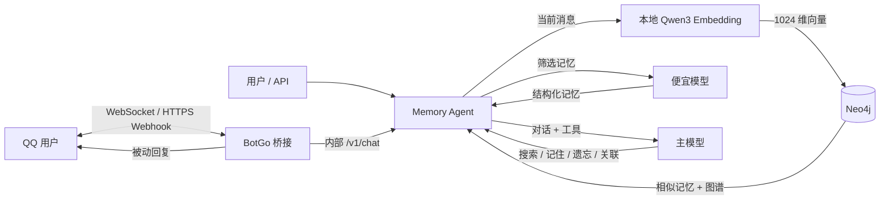

# Qwen + Neo4j 长期记忆助手

[](https://github.com/VesperGlow/QQ-agent/actions/workflows/build.yml)

这是一个可直接容器化部署的原型：本地 `Qwen3-Embedding-0.6B` 负责向量化，Neo4j 同时保存向量、记忆节点和图谱关系；便宜模型筛选长期记忆，主模型负责对话与工具调用；腾讯官方 BotGo 桥接容器负责与 QQ 单聊、群聊和频道通信。



## 最快启动

宿主机只需要 Docker，不需要 Python、Java、Neo4j 或模型运行环境。

1. 安装 Docker Engine（Linux VPS）或 Docker Desktop（Windows/macOS），并确认 `docker compose version` 能运行。
2. 进入本目录，复制配置：

   ```sh
   cp .env.example .env
   ```

3. 编辑 `.env`，至少填写：

   ```dotenv
   AI_BASE_URL=https://你的供应商地址/v1
   AI_API_KEY=你的key
   MEMORY_MODEL=便宜模型名
   CHAT_MODEL=支持工具调用的主模型名
   APP_API_KEY=一段长随机字符串
   NEO4J_PASSWORD=另一段长随机字符串
   QQ_APP_ID=QQ开放平台的AppID
   QQ_APP_SECRET=QQ开放平台的AppSecret
   ```

4. CPU 启动：

   ```sh
   docker compose up -d --build
   ```

   NVIDIA GPU（已装驱动和 NVIDIA Container Toolkit）：

   ```sh
   docker compose -f compose.yaml -f compose.gpu.yaml up -d --build
   ```

5. 查看首次下载与启动进度：

   ```sh
   docker compose logs -f embedding app
   ```

模型首次启动会下载约 GB 级文件。完成后访问 `http://127.0.0.1:8000` 使用简易聊天页；API 文档在 `http://127.0.0.1:8000/docs`；Neo4j Browser 在 `http://127.0.0.1:7474`。

VPS 默认仅监听 `127.0.0.1`，建议用 SSH 隧道或反向代理加 HTTPS，不要直接把 Neo4j 端口暴露到公网。确需对外提供应用 API 时，把 `APP_BIND_IP` 改为 `0.0.0.0`。

## 关键环境变量

| 变量 | 默认值 | 用途 |
|---|---|---|
| `AI_BASE_URL` | 无 | OpenAI-compatible API 根地址，代码会拼接 `/chat/completions` |
| `AI_API_KEY` | 无 | AI 提供商密钥 |
| `MEMORY_MODEL` | 无 | 便宜的记忆筛选模型 |
| `CHAT_MODEL` | 无 | 对话和工具调用模型 |
| `EMBEDDING_BASE_URL` | `http://embedding:80` | Embedding 接口地址 |
| `EMBEDDING_API_STYLE` | `tei` | `tei` 或 `openai` |
| `EMBEDDING_MODEL` | `Qwen/Qwen3-Embedding-0.6B` | 本地或远程模型名 |
| `EMBEDDING_DIMENSIONS` | `1024` | Neo4j 向量索引维度；Qwen 支持 32–1024 |
| `EMBEDDING_CONTEXT_SIZE` | `32768` | Embedding 最大批 token 数；小内存 VPS 建议 4096/8192 |
| `MEMORY_RECENCY_WEIGHT` | `0.15` | 时序加权检索：新近度加成权重（0=关闭，纯相似度排序） |
| `MEMORY_IMPORTANCE_WEIGHT` | `0.10` | 时序加权检索：重要性加成权重 |
| `MEMORY_RECENCY_HALFLIFE_DAYS` | `30` | 新近度衰减半衰期（天）；越小越偏向近期记忆 |
| `NEO4J_URI` | `bolt://neo4j:7687` | Neo4j Bolt 地址 |
| `APP_API_KEY` | 无 | 此服务自己的 Bearer Token；公网部署必须配置 |
| `QQ_APP_ID` | 无 | QQ 开放平台机器人 AppID |
| `QQ_APP_SECRET` | 无 | QQ 机器人 AppSecret，用于 Access Token 和 Webhook 验签 |
| `QQ_EVENT_MODE` | `webhook` | QQ 事件接入模式：`websocket` 或 `webhook` |
| `QQ_WEBHOOK_PATH` | `/qqbot` | Webhook 模式下的 QQ 平台回调路径 |
| `QQ_SYSTEM_PROMPT` | 无 | 全局人设，整体替换助手性格/口吻；安全与工具规则始终保留 |
| `MCP_SERVERS_JSON` | `[]` | 远程 MCP 工具服务器列表，详见下方「MCP 工具」 |

> 机器人定位为个人情感陪伴，仅处理 QQ 私聊（C2C），不支持群聊与频道。

维度一旦建好索引便不能原地修改。要改变 `EMBEDDING_DIMENSIONS`，需要删除旧向量索引并重新生成全部记忆向量；全新测试环境也可以用 `docker compose down -v` 清空数据后重建（这会永久删除全部 Neo4j 数据和模型缓存）。

## 对话 API

```sh
curl http://127.0.0.1:8000/v1/chat \
  -H 'Content-Type: application/json' \
  -H 'Authorization: Bearer 你的APP_API_KEY' \
  -d '{
    "user_id": "sorak",
    "message": "请记住，我偏好简洁的中文回答。"
  }'
```

响应会包含：

- `message`：主模型回答；
- `retrieved_memories`：本轮向量检索命中的记忆；
- `saved_memories`：便宜模型本轮自动筛选并保存的记忆；
- `tool_events`：主模型调用过的记忆工具；
- `conversation_id`：后续请求带回即可保留短期对话历史。

主要接口：

- `POST /v1/chat`：对话；
- `POST /v1/memories`：手工写入记忆；
- `GET /v1/memories/search`：语义搜索；
- `GET /v1/memories/recent`：最近记忆；
- `DELETE /v1/memories/{id}`：软删除/遗忘；
- `POST /v1/memories/link`：建立记忆关系；
- `GET /v1/graph/{user_id}`：导出小型图谱快照；
- `GET /health`：检查三项依赖。

## MCP 工具（联网搜索 / 网页抓取）

主模型除了内置的记忆工具，还可以调用远程 MCP 服务器提供的工具。通过 `MCP_SERVERS_JSON`（JSON 数组）配置，每项字段：

- `name`（必填）：服务器标识，工具会以 `mcp__<name>__<tool>` 暴露给模型；
- `url`（必填）：MCP 服务器地址，可用 `${NAME}` 引用环境变量（便于只在 env 填 key）；
- `transport`：`streamable_http`（默认）或 `sse`；
- `headers`：可选请求头对象，同样支持 `${NAME}`；
- `tools` / `exclude`：工具名白名单 / 黑名单，按需挑选以节省 token；
- `enabled`：设为 `false` 可临时停用某项。

Tavily 与 Firecrawl 均提供托管的 streamable-http 端点，把 API key 单独放进环境变量、URL 里用 `${...}` 引用即可。下面这组只注册 Tavily 联网搜索与 Firecrawl 网页抓取，避免功能重叠浪费 token：

```dotenv
TAVILY_KEY=tvly-你的KEY
FIRECRAWL_KEY=fc-你的完整APIKEY
MCP_SERVERS_JSON=[{"name":"tavily","url":"https://mcp.tavily.com/mcp/?tavilyApiKey=${TAVILY_KEY}","tools":["tavily_search"]},{"name":"firecrawl","url":"https://mcp.firecrawl.dev/${FIRECRAWL_KEY}/v2/mcp","tools":["firecrawl_scrape"]}]
```

`CHAT_MODEL` 需支持 OpenAI tool calling；`GET /health` 的 `mcp_tools` 字段会显示已注册的 MCP 工具数量。

## 数据结构

- `(User)-[:HAS_CONVERSATION]->(Conversation)-[:HAS_MESSAGE]->(Message)` 保存短期对话历史；
- `(User)-[:HAS_MEMORY]->(Memory)` 保存长期记忆和向量；
- `(Memory)-[:MENTIONS]->(Entity)` 形成实体图谱；
- `(Memory)-[:RELATED_TO {kind}]->(Memory)` 保存主模型建立的记忆关系。

所有记忆操作都按 `user_id` 隔离。遗忘采用软删除，节点仍可审计但不会再被检索。

检索使用 Cypher 25 的 `SEARCH` 子句做向量召回（取代已弃用的 `db.index.vector.queryNodes`，需 Neo4j 2026.02+），再在图内叠加**时序加权**：综合相似度、新近度（以 `last_seen_at` 为锚做半衰期衰减，被反复提及的记忆更"新鲜"）、重要性与访问次数排序。权重见上方 `MEMORY_*_WEIGHT`，全设 0 即退回纯相似度。返回给上层的 `score` 仍是原始余弦相似度。

## 资源建议

- CPU 部署：建议至少 4 核、8 GB RAM；内存较小时先把 `EMBEDDING_CONTEXT_SIZE=4096`。
- GPU 部署：需要支持的 NVIDIA GPU、正确驱动及 Container Toolkit。
- 磁盘：建议预留至少 8–10 GB 给镜像、模型缓存和数据库。

## 备份与更新

Neo4j 数据和模型分别保存在 Docker volume `neo4j_data`、`model_cache`。不要把 `docker compose down -v` 当成普通停止命令；日常停止使用：

```sh
docker compose stop
```

查看错误：

```sh
docker compose ps
docker compose logs --tail=200 app embedding neo4j
```

如果主模型供应商不接受 `tools` 参数，服务会保留自动向量检索并降级为普通对话，同时在 `warnings` 中说明；要完整使用“记住/遗忘/关联”工具，应选择支持 OpenAI tool calling 格式的模型。

## 接入 QQ 机器人

本项目使用腾讯官方 `tencent-connect/botgo` v0.2.1，自动用 `AppID + AppSecret` 获取并刷新 Access Token，并可通过 `QQ_EVENT_MODE` 在 WebSocket 与 HTTPS Webhook 之间切换。

1. 在 [QQ 开放平台](https://q.qq.com/) 创建机器人，把 `AppID` 和 `AppSecret` 写入 `.env`。
2. 使用 WebSocket 时设置以下变量。它由容器主动连接 QQ，不需要公网域名或反向代理：

   ```dotenv
   QQ_EVENT_MODE=websocket
   ```

3. 使用 Webhook 时设置 `QQ_EVENT_MODE=webhook`，并给 `qqbot:9000` 配置公网 HTTPS 反向代理。默认宿主机只监听 `127.0.0.1:9000`，例如 Nginx：

   ```nginx
   location /qqbot {
       proxy_pass http://127.0.0.1:9000;
       proxy_set_header Host $host;
       proxy_set_header X-Forwarded-For $proxy_add_x_forwarded_for;
       proxy_set_header X-Forwarded-Proto https;
   }
   ```

4. Webhook 模式下，在 QQ 开放平台把回调地址配置为 `https://你的域名/qqbot`。平台会发起签名校验，BotGo 会自动完成响应。
5. 本项目仅订阅私聊事件 `C2C_MESSAGE_CREATE`（个人情感陪伴定位，不处理群聊与频道）。

6. 把 VPS 的固定公网出口 IP 加入机器人 IP 白名单；机器人上线前，在开放平台配置沙箱成员。
7. 检查桥接状态和日志：

   ```sh
   curl http://127.0.0.1:9000/healthz
   docker compose logs -f qqbot
   ```

Webhook 收到事件后会立即确认，再异步调用 AI，避免慢模型触发平台重试；WebSocket 会自动维护会话、心跳和重连。两种模式共用同一套消息处理逻辑：按 `msg_id` 去重、按用户会话串行处理，并用 `msg_seq` 对长回复分片。QQ 的 OpenID 只以稳定哈希形式写入 Neo4j，不直接保存原始 OpenID。

目前 QQ 附件只会得到“暂不支持”的文字提示；文本消息、记忆检索、自动记忆和主模型工具调用均完整接通。

## GHCR 镜像

`main` 分支通过测试后，GitHub Actions 会发布两个 `linux/amd64` 镜像：

```text
ghcr.io/vesperglow/qq-agent-app:latest
ghcr.io/vesperglow/qq-agent-qqbot:latest
```

每次发布也会生成 `sha-<完整提交号>` 标签，生产环境可以锁定该标签，避免 `latest` 变化。

在 VPS 上使用预构建镜像：

```sh
cp .env.example .env
# 编辑 .env 后：
docker compose pull
docker compose up -d --no-build
```

GHCR 首次发布的个人包通常是私有的。私有状态下，先创建带 `read:packages` 权限的 GitHub PAT，然后登录：

```sh
echo "$GHCR_TOKEN" | docker login ghcr.io -u VesperGlow --password-stdin
```

如需免登录拉取，请分别进入 [app 包设置](https://github.com/users/VesperGlow/packages/container/qq-agent-app/settings) 和 [qqbot 包设置](https://github.com/users/VesperGlow/packages/container/qq-agent-qqbot/settings)，将可见性改为 `Public`。

本地开发仍可使用 `docker compose up -d --build`，Compose 会按 `APP_IMAGE` 和 `QQBOT_IMAGE` 给本地构建结果打标签。
