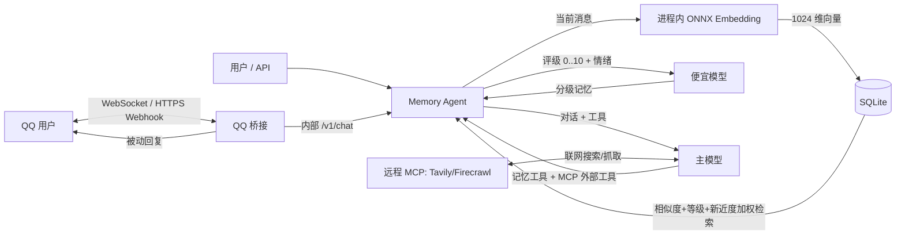

# Qwen + SQLite 分级记忆助手

[](https://github.com/VesperGlow/QQ-agent/actions/workflows/build.yml)

这是一个可直接容器化部署的个人情感陪伴助手：**一个 Rust 单二进制**（axum + rusqlite + ort）内完成一切——进程内跑 uint8 量化的 `Qwen3-Embedding-0.6B`（ONNX）做向量化，SQLite 单文件保存对话、分级记忆与情绪时间线；便宜模型给每条候选记忆评定 0..10 的记忆等级并抽取情绪，主模型负责对话与工具调用；QQ 桥接按官方开放平台协议与私聊（C2C）通信。填好 `.env` 一条命令即可启动，稳态内存 1GB 以内。



## 功能总览

- **分级记忆（0..10）**：便宜模型给每条候选记忆评级——0 只进短期上下文不入库，1..9 按天数梯度保留（被再次提及自动续期，常提起的记忆越活越久），10 永久（纯寒暄短消息自动跳过评级省 token）；主模型对话并按需调用记忆工具。
- **短期上下文 + 滚动摘要**：每会话最近 N 条原文滑动窗口，确定顺序不丢；更早的消息后台压缩进会话摘要，超长对话也保留连续性。
- **单文件存储**：SQLite 一个文件装下对话、记忆向量（float16）、实体关联与情绪时间线，备份即拷文件，所有记忆按 `user_id` 隔离。
- **加权检索**：numpy 暴力余弦召回（个人记忆库量级毫秒出结果），叠加新近度、记忆等级与关键词命中排序（见[数据结构](#数据结构)）。
- **记忆演变（SUPERSEDES）**：用户情况变化时新记忆取代旧记忆并保留可回溯的时间线。
- **记忆主体（subject）**：区分“关于用户”与“助手自己的承诺 / 人设”，检索时分组呈现、互不混淆。
- **情绪时间线**：从对话抽取情绪按时间成链，让助手感知跨会话情绪趋势。
- **分层提示词**：人设层（app 级 `PERSONA_PROMPT` 可整体替换口吻，对所有入口生效）与系统指令层（输出格式如禁用 Markdown、记忆/工具、安全，完整内容维护在 `.env.example` 的 `SYSTEM_INSTRUCTIONS` 里、非硬编码）分离，系统指令始终生效、优先于人设。
- **MCP 工具**：通过 `MCP_SERVERS_JSON` 接入 Tavily 联网搜索、Firecrawl 网页抓取等远程 MCP 服务器（见 [MCP 工具](#mcp-工具联网搜索--网页抓取)）。
- **纯私聊定位**：个人情感陪伴，只处理 QQ 私聊（C2C），不支持群聊与频道。
- **零本地依赖部署**：宿主机仅需 Docker，镜像由 GitHub Actions 编译并发布到 GHCR。

## 最快启动

宿主机只需要 Docker，不需要 Python、数据库或模型运行环境。

1. 安装 Docker Engine（Linux VPS）或 Docker Desktop（Windows/macOS），并确认 `docker compose version` 能运行。
2. 进入本目录，复制配置：

   ```sh
   cp .env.example .env
   ```

3. 编辑 `.env`，至少填写：

   ```dotenv
   AI_BASE_URL=https://你的供应商地址/v1
   AI_API_KEY=你的key
   MEMORY_MODEL=便宜模型名
   CHAT_MODEL=支持工具调用的主模型名
   APP_API_KEY=一段长随机字符串
   QQ_APP_ID=QQ开放平台的AppID
   QQ_APP_SECRET=QQ开放平台的AppSecret
   ```

4. 启动：

   ```sh
   docker compose up -d --build
   ```

5. 查看首次下载与启动进度：

   ```sh
   docker compose logs -f agent
   ```

embedding 模型首次启动会自动下载（约 640MB，缓存进 `model_cache` 卷，之后不再下）。完成后访问 `http://127.0.0.1:8000` 使用简易聊天页；API 文档在 `http://127.0.0.1:8000/docs`。

VPS 默认仅监听 `127.0.0.1`，建议用 SSH 隧道或反向代理加 HTTPS。确需对外提供应用 API 时，把 `APP_BIND_IP` 改为 `0.0.0.0`。

## 关键环境变量

| 变量 | 默认值 | 用途 |
|---|---|---|
| `AI_BASE_URL` | 无 | OpenAI-compatible API 根地址，代码会拼接 `/chat/completions` |
| `AI_API_KEY` | 无 | AI 提供商密钥 |
| `MEMORY_MODEL` | 无 | 便宜的记忆筛选模型 |
| `CHAT_MODEL` | 无 | 对话和工具调用模型 |
| `PERSONA_PROMPT` | 无 | 全局人设（app 级），只写性格/口吻，对 QQ/网页/API 全部生效；留空用内置默认。输出格式、记忆工具与安全属独立的系统指令层，始终生效 |
| `SYSTEM_INSTRUCTIONS` | 见 `.env.example` | 系统指令层，完整推荐内容已写在 `.env.example` 里（不再硬编码在代码中）；留空时代码只兜底一句极简约束，不建议留空。多行用字面量 `\n`，自定义需自含格式与安全约束 |
| `MEMORY_JUDGE_SKIP_TRIVIAL` | `true` | 纯寒暄短消息跳过记忆筛选与情绪抽取，省便宜模型调用 |
| `CONVERSATION_SUMMARY_ENABLED` | `true` | 滚动摘要：旧消息后台压缩进会话摘要 |
| `EMBEDDING_API_STYLE` | `local` | `local`（进程内 ONNX 推理）或 `openai`（远程接口，需配 `EMBEDDING_BASE_URL`） |
| `EMBEDDING_MODEL` | `electroglyph/Qwen3-Embedding-0.6B-onnx-uint8` | 本地 HF 仓库名或远程模型名 |
| `EMBEDDING_DIMENSIONS` | `1024` | 向量维度；Qwen 支持 Matryoshka 截取 32–1024 |
| `EMBEDDING_CONTEXT_SIZE` | `512` | 单条输入 token 上限，可设 `64..32768`；激活内存随长度增长（attention 部分平方级），越小推理峰值越低，超长输入自动截断。记忆/聊天场景 512 足够，做长文档向量化再调高 |
| `EMBEDDING_THREADS` | `4` | ONNX 推理线程数，按 CPU 核数调整 |
| `DB_PATH` | `/data/memory.db` | SQLite 数据库文件路径 |
| `MEMORY_LEVEL_TTL_DAYS` | `2,4,…,365` | 等级 1..9 的保留天数梯度；0 不入库，10 永久，被再次提及自动续期 |
| `MEMORY_RECENCY_WEIGHT` | `0.15` | 加权检索：新近度加成权重（0=关闭，纯相似度排序） |
| `MEMORY_IMPORTANCE_WEIGHT` | `0.10` | 加权检索：记忆等级加成权重 |
| `MEMORY_KEYWORD_WEIGHT` | `0.08` | 加权检索：关键词字面命中加成权重 |
| `MEMORY_RECENCY_HALFLIFE_DAYS` | `30` | 新近度衰减半衰期（天）；越小越偏向近期记忆 |
| `APP_API_KEY` | 无 | 此服务自己的 Bearer Token；公网部署必须配置 |
| `QQ_APP_ID` | 无 | QQ 开放平台机器人 AppID |
| `QQ_APP_SECRET` | 无 | QQ 机器人 AppSecret，用于 Access Token 和 Webhook 验签 |
| `QQ_EVENT_MODE` | `webhook` | QQ 事件接入模式：`websocket` 或 `webhook` |
| `QQ_WEBHOOK_PATH` | `/qqbot` | Webhook 模式下的 QQ 平台回调路径 |
| `MCP_SERVERS_JSON` | `[]` | 远程 MCP 工具服务器列表，详见下方「MCP 工具」 |
| `MCP_TIMEOUT_SECONDS` | `300` | 单次 MCP 工具调用的读超时（秒），超时会中断该次调用并把错误回传给模型 |
| `SHUTDOWN_TIMEOUT_SECONDS` | `30` | 优雅停机：收到 SIGTERM/Ctrl-C 后等待在途消息与落库（历史/记忆/摘要/情绪）完成的上限；容器 stop 宽限期需大于该值（compose 已设 40s） |
| `CHAT_IMAGE_ENABLED` | `true` | 图片理解：QQ 图片附件 / API `images` 以 image_url 传给 `CHAT_MODEL`（须支持视觉）。图片不落库，历史记为 `[图片×N]` |
| `CHAT_IMAGE_MAX_COUNT` | `3` | 单条消息最多带几张图片 |
| `CHAT_IMAGE_MAX_BYTES` | `5242880` | 单张图片大小上限（字节） |
| `LOG_CONTENT_PREVIEW_CHARS` | `40` | 运行日志里消息/记忆内容预览的最大字符数；`0` 完全不记内容，日志只留长度与统计 |

> 机器人定位为个人情感陪伴，仅处理 QQ 私聊（C2C），不支持群聊与频道。

已入库的向量按写入时的维度保存。要改变 `EMBEDDING_DIMENSIONS` 或换 embedding 模型，需要重新生成全部记忆向量；全新测试环境也可以用 `docker compose down -v` 清空数据后重建（这会永久删除全部记忆数据和模型缓存）。

## 对话 API

```sh
curl http://127.0.0.1:8000/v1/chat \
  -H 'Content-Type: application/json' \
  -H 'Authorization: Bearer 你的APP_API_KEY' \
  -d '{
    "user_id": "sorak",
    "message": "请记住，我偏好简洁的中文回答。"
  }'
```

可选 `images` 字段附带图片（需 `CHAT_MODEL` 支持视觉）：元素可以是裸 base64、`data:image/…;base64,…` data URI，或 http(s) 图片 URL；带图片时 `message` 可以为空。数量与大小上限见 `CHAT_IMAGE_MAX_COUNT` / `CHAT_IMAGE_MAX_BYTES`。QQ 私聊里直接发图即可，图文混发会一起理解。

响应会包含：

- `message`：主模型回答；
- `retrieved_memories`：本轮向量检索命中的记忆；
- `saved_memories`：便宜模型本轮自动筛选并保存的记忆；
- `tool_events`：主模型调用过的记忆工具；
- `conversation_id`：后续请求带回即可保留短期对话历史。

主要接口：

- `POST /v1/chat`：对话；
- `POST /v1/memories`：手工写入记忆；
- `GET /v1/memories/search`：语义搜索；
- `GET /v1/memories/recent`：最近记忆；
- `DELETE /v1/memories/{id}`：软删除/遗忘；
- `GET /v1/memories/{id}/history`：沿 SUPERSEDES 链回溯一条记忆的演变时间线；
- `POST /v1/memories/link`：建立记忆关系；
- `GET /v1/mood/{user_id}`：情绪时间线与近期趋势聚合；
- `GET /v1/graph/{user_id}`：导出小型图谱快照；
- `GET /health`：检查三项依赖。

## MCP 工具（联网搜索 / 网页抓取）

主模型除了内置的记忆工具，还可以调用远程 MCP 服务器提供的工具。通过 `MCP_SERVERS_JSON`（JSON 数组）配置，每项字段：

- `name`（必填）：服务器标识，工具会以 `mcp__<name>__<tool>` 暴露给模型；
- `url`（必填）：MCP 服务器地址，可用 `${NAME}` 引用环境变量（便于只在 env 填 key）；
- `transport`：`streamable_http`（默认）或 `sse`；
- `headers`：可选请求头对象，同样支持 `${NAME}`；
- `tools` / `exclude`：工具名白名单 / 黑名单，按需挑选以节省 token；
- `enabled`：设为 `false` 可临时停用某项。

Tavily 与 Firecrawl 均提供托管的 streamable-http 端点，把 API key 单独放进环境变量、URL 里用 `${...}` 引用即可。下面这组只注册 Tavily 联网搜索与 Firecrawl 网页抓取，避免功能重叠浪费 token：

```dotenv
TAVILY_KEY=tvly-你的KEY
FIRECRAWL_KEY=fc-你的完整APIKEY
MCP_SERVERS_JSON=[{"name":"tavily","url":"https://mcp.tavily.com/mcp/?tavilyApiKey=${TAVILY_KEY}","tools":["tavily_search"]},{"name":"firecrawl","url":"https://mcp.firecrawl.dev/${FIRECRAWL_KEY}/v2/mcp","tools":["firecrawl_scrape"]}]
```

`CHAT_MODEL` 需支持 OpenAI tool calling；`GET /health` 的 `mcp_tools` 字段会显示已注册的 MCP 工具数量。

## 数据结构

所有数据在一个 SQLite 文件里（`DB_PATH`，默认 `/data/memory.db`，WAL 模式）：

- `conversations` / `messages`：短期对话历史（`seq` 自增保证顺序确定；会话上的 `summary` 滚动压缩更早的对话）；
- `memories`：长期记忆——正文、`level`（1..10 等级）、`subject`（user/assistant）、float16 向量 BLOB、`expires_at`（按等级梯度计算，10 级为 NULL 永久；被再次提及即以当下时间续期）；过期记忆先从检索里消失，宽限 7 天后物理清除；
- `entities` / `memory_entities`：记忆提及的人、项目、地点等实体关联；
- `memory_links`：主模型建立的记忆间关系；
- 记忆演变：`superseded_by` 链记录取代关系，旧记忆软停用但保留，可经 `/history` 回溯时间线；
- `moods`：情绪时间线，从每条消息抽取的情绪（label/valence/note）按时间排列。

情绪识别折叠进"记忆筛选"那一次廉价模型调用里（不额外耗 token），仅在消息明确流露情绪时记录。每轮对话前会把近期情绪趋势压成一行注入上下文，让助手自然体察用户状态。由 `MOOD_TRACKING_ENABLED` 开关、`MOOD_TREND_DAYS` 控制回看窗口。

所有记忆操作都按 `user_id` 隔离。遗忘采用软删除，节点仍可审计但不会再被检索。

每条记忆带 `subject` 区分主体：`user`（关于用户的事实/偏好，自动筛选只产出这类）与 `assistant`（助手自己对用户的承诺、约定或人设设定）。检索时按主体分组呈现给模型、互不混淆；写入会按主体隔离去重；旧数据无该字段时默认视为 `user`。

检索把该用户的全部有效记忆向量载入 numpy 做暴力余弦（向量入库前已归一化，点积即余弦；个人记忆库量级毫秒出结果），再叠加**加权排序**：综合相似度、新近度（以 `last_seen_at` 为锚做半衰期衰减，被反复提及的记忆更"新鲜"）、记忆等级与查询关键词的字面命中。权重见上方 `MEMORY_*_WEIGHT`，全设 0 即退回纯相似度。返回给上层的 `score` 仍是原始余弦相似度。

## 资源建议

- CPU 部署：2 核、2 GB RAM 即可跑（uint8 量化权重约 650MB 常驻，稳态总占用约 1GB，compose 默认 `mem_limit: 2g` 兜底）；内存更紧可把 `EMBEDDING_CONTEXT_SIZE`（默认 512）进一步调低。
- 磁盘：建议预留 2–3 GB 给镜像、模型缓存和数据库。
- **怎么看内存水位**：模型权重是 mmap 的文件页缓存，内存紧张时内核可直接回收，不是硬占用——所以 `docker stats` / RSS 显示的数字会明显偏大。判断真实水位看匿名内存：`cat /proc/<pid>/smaps_rollup` 里的 `Anonymous` 行（容器内 pid 1），或 cgroup 的 `memory.stat` 里 `anon` 项。给 `mem_limit` 定值时按匿名内存 + 少量余量即可，不必为页缓存留满 650MB。
- 不想在本机跑推理时，设 `EMBEDDING_API_STYLE=openai` 用供应商的 embedding 接口（注意换模型/维度需重建已有记忆向量）。

## 备份与更新

SQLite 数据库和模型缓存分别保存在 Docker volume `app_data`、`model_cache`。备份只需拷出 `/data/memory.db` 一个文件。不要把 `docker compose down -v` 当成普通停止命令；日常停止使用：

```sh
docker compose stop
```

查看错误：

```sh
docker compose ps
docker compose logs --tail=200 agent
```

如果主模型供应商不接受 `tools` 参数，服务会保留自动向量检索并降级为普通对话，同时在 `warnings` 中说明；要完整使用“记住/遗忘/关联”工具，应选择支持 OpenAI tool calling 格式的模型。

## 接入 QQ 机器人

QQ 桥接按腾讯官方开放平台协议实现（与 `tencent-connect/botgo` 行为对齐），自动用 `AppID + AppSecret` 获取并刷新 Access Token，并可通过 `QQ_EVENT_MODE` 在 WebSocket 与 HTTPS Webhook 之间切换。

1. 在 [QQ 开放平台](https://q.qq.com/) 创建机器人，把 `AppID` 和 `AppSecret` 写入 `.env`。
2. 使用 WebSocket 时设置以下变量。它由容器主动连接 QQ，不需要公网域名或反向代理：

   ```dotenv
   QQ_EVENT_MODE=websocket
   ```

3. 使用 Webhook 时设置 `QQ_EVENT_MODE=webhook`，并给容器的 `9000` 端口配置公网 HTTPS 反向代理。默认宿主机只监听 `127.0.0.1:9000`，例如 Nginx：

   ```nginx
   location /qqbot {
       proxy_pass http://127.0.0.1:9000;
       proxy_set_header Host $host;
       proxy_set_header X-Forwarded-For $proxy_add_x_forwarded_for;
       proxy_set_header X-Forwarded-Proto https;
   }
   ```

4. Webhook 模式下，在 QQ 开放平台把回调地址配置为 `https://你的域名/qqbot`。平台会发起签名校验，服务会自动完成响应。
5. 本项目仅订阅私聊事件 `C2C_MESSAGE_CREATE`（个人情感陪伴定位，不处理群聊与频道）。

6. 把 VPS 的固定公网出口 IP 加入机器人 IP 白名单；机器人上线前，在开放平台配置沙箱成员。
7. 检查桥接状态和日志：

   ```sh
   curl http://127.0.0.1:9000/healthz
   docker compose logs -f agent
   ```

Webhook 收到事件后会立即确认，再异步调用 AI，避免慢模型触发平台重试；WebSocket 会自动维护会话、心跳和重连。两种模式共用同一套消息处理逻辑：按 `msg_id` 去重、按用户会话串行处理，并用 `msg_seq` 对长回复分片。QQ 的 OpenID 只以稳定哈希形式写入数据库，不直接保存原始 OpenID。

目前 QQ 附件只会得到“暂不支持”的文字提示；文本消息、记忆检索、自动记忆和主模型工具调用均完整接通。

## GHCR 镜像

`main` 分支通过测试后，GitHub Actions 会发布一个 `linux/amd64` 镜像（单个 Rust 二进制，包含 API、embedding、存储与 QQ 桥接）：

```text
ghcr.io/vesperglow/qq-agent:latest
```

每次发布也会生成 `sha-<完整提交号>` 标签，生产环境可以锁定该标签，避免 `latest` 变化。

在 VPS 上使用预构建镜像：

```sh
cp .env.example .env
# 编辑 .env 后：
docker compose pull
docker compose up -d --no-build
```

GHCR 首次发布的个人包通常是私有的。私有状态下，先创建带 `read:packages` 权限的 GitHub PAT，然后登录：

```sh
echo "$GHCR_TOKEN" | docker login ghcr.io -u VesperGlow --password-stdin
```

如需免登录拉取，请进入 [qq-agent 包设置](https://github.com/users/VesperGlow/packages/container/qq-agent/settings)，将可见性改为 `Public`。

本地开发仍可使用 `docker compose up -d --build`，Compose 会按 `APP_IMAGE` 给本地构建结果打标签。
